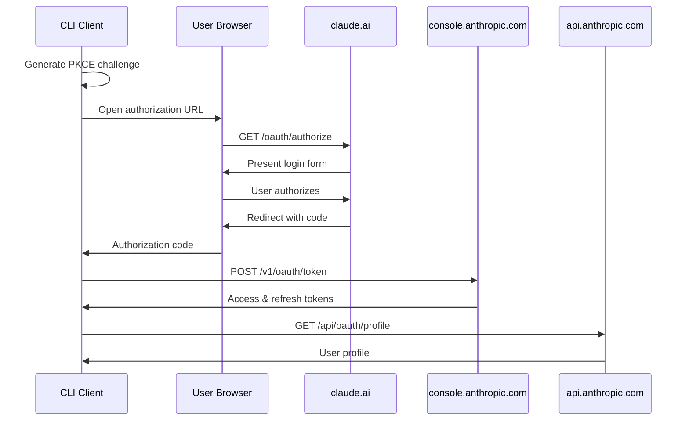

# OAuth 2.0 PKCE Flow

OAuth authentication for Claude CLI.

**Client ID**: `9d1c250a-e61b-44d9-88ed-5944d1962f5e`  
**Redirect URI**: `http://localhost:54545/callback`  
**Scopes**: `org:create_api_key user:profile user:inference`



## PKCE Generation

```
code_verifier = base64url(random(43-128 chars))
code_challenge = base64url(sha256(code_verifier))
```

## Token Format

- **Access**: `sk-ant-oat01-...` (8 hours)
- **Refresh**: `sk-ant-ort01-...`